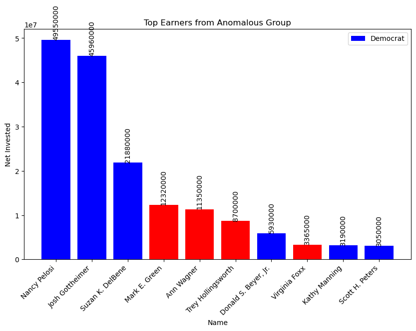
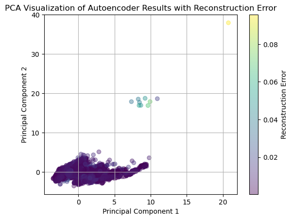
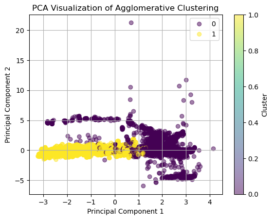

# Anomaly Detection of US Congressional Investments

  

  <a href="https://github.com/tiffchu/Anomaly_Detection_US_Senate/issues">Report Bug</a> ·
  <a href="https://github.com/tiffchu/Anomaly_Detection_US_Senate/issues">Request Features</a> ·
  <a href="https://sites.google.com/view/tiff-anomaly-detection/home">Live Demo</a>

<!-- TABLE OF CONTENTS -->

  
Table of Contents

  <ol>
    <li>
      <a href="#about-the-project">About The Project</a>
    </li>
    <li>
      <a href="#getting-started">Getting Started</a>
      <ul>
        <li><a href="#prerequisites">Datasets</a></li>
      </ul>
    </li>
    <li><a href="#approach">Approach</a></li>
    <li><a href="#roadmap">Roadmap</a></li>
    <li><a href="#eda">EDA</a></li>
    <li><a href="#Modelling">Modelling</a></li>
    <li><a href="#next-steps">Next Steps</a></li>
    <li><a href="#Findings">Findings</a></li>
    <li><a href="#license">License</a></li>
    <li><a href="#contact">Contact</a></li>
    <li><a href="#acknowledgments">Acknowledgments</a></li>
  </ol>

<!-- ABOUT-THE-PROJECT -->
## About The Project  📈

This capstone analyzes time series data of stock transactions from US congress members, and aims to identify anomalies that may point to insider trading.

#### Problem Statement 🤯
* Members of Congress wield significant influence over companies they invest in, raising concerns about potential conflicts of interest and unfair advantages in financial markets
* The STOCK Act mandates public reporting of asset transactions by Congress members, providing an opportunity to detect and prevent insider trading
* This project addresses the challenge of identifying abnormal stock purchases that may warrant further investigation.
others

<!-- GETTING STARTED -->
## Getting Started
Download the jupyter file in this repository, or open it in google colab. 

### Dataset 
The dataset consists of combined data from Senate stock transactions and stock news events. It covers the period from 2020 to 2023 and contains approximately 30,000 rows and 12 relevant columns. Data quality concerns include missing values in news events and potential overlaps in news event timelines with transaction dates.

These are the datasets I'll be using 
- [Congress trades dataset](https://senatestockwatcher.com/api)
- S&P Data from Yfinance

<!-- ROADMAP -->
## Roadmap 

- [x] EDA
- [x] Update Readme
- [x] Feature Engineering
- [x] Merge dataset with stock data metrics 
- [x] Scaling
- [x] One hot encoding
- [x] Choose algorithms to classify data, and calculate their performance
    - [x] Clustering
    - [x] Encoders
- [x] Combining the results of both models into a new dataset for anomalous rows 
- [x] Visualizations, interpreting model
- [x] Product Demo - Web App 

(<a href="#readme-top">back to top</a>)

<!-- APPROACH -->
## Approach

The project takes a data-driven approach by combining numerical and textual data from Senate stock transactions and financial news. Unsupervised machine learning algorithms, including hierarchical clustering and LSTM autoencoders, are utilized for anomaly detection. Feature engineering techniques such as stock performance and market indices are used to enhance model performance.

<!-- EDA -->
## EDA

1. **Data Processing**: Merge and preprocess datasets, handle missing values, and ensure data consistency.
2. **Feature Engineering**: Extract relevant features, including temporal, numerical, and textual features. Then incorporate market indices.
3. **Sort Data**: Based on transaction dates, and make sure the merged dataset has matching dates.
4. **Summary Statistics**: Finding the central tendencies of the data, more info on the dataset after merging different sources of info.
5. **Time Series Plots**: Baseline visualizations of the data based on dates
6. **Scaling data**: So that certain columns dont dominate others. - Using standard scaler.
7. **One hot encoding**: Turning categorical columns (type, party, industry, sector, owner) into numerical

<!-- MODELLING -->
**Hierarchical Clustering**
- using unsupervised learning to find two clusters - anomaly and non-anomaly. Using agglomerative clustering for grouping similar objects into clusters and also determine distances between points and sub-clusters at multiple levels.
- to identify the anomalous cluster, I chose the smaller cluster with points that are further from the central point.
  
**Autoencoders**
- autoencoders are often used in unsupervised anomaly detection tasks where labeled data for training and testing are not available
- its a neural network that can be used for unsupervised learning tasks like anomaly detection
it consists of an encoder and a decoder. The encoder compresses the input data into a lower-dimensional representation, and the decoder reconstructs the original input from this compressed representation, basically reducing its dimensions. It then predicts and reconstructs the data
- anomalous rows should have really high reconstruction error, setting a threshold to classify points above it to be anomalous

(<a href="#readme-top">back to top</a>)

  
<!-- NEXT STEPS -->
## Next Steps
- **Research Online**: Use domain knowledge to interpret the anomalies. confirm through manually searching anomalies. Update site as new information is released 
- **Documentation and Reporting**: Communicate results to stakeholders.
- **Implement feedback**: Get feedback from friends and peers. Talk to those with domain knowledge and see if they can confirm my findings.
- **Improve Website**: Have a few judge the website and see how I can improve or add more to it.

<!-- FINDINGS -->
## Findings
- posted on site: [https://sites.google.com/view/tiff-anomaly-detection/home](https://sites.google.com/view/tiff-anomaly-detection/home)
- from extracting the congress members from anomalous rows, it is evident that those anomalies perform much better than the average law-abiding investor and non-anomalous congress members
- the sheer volume and return of these anomalous congress members a much greater than when compared to stock market metrics like the S&P price and volume -- an indicator of market performance
- oftentimes, they invest in the market (make a buy transaction) when the market is down or lower than average (when S&P price is low)
- they also invest in the same sector that they are involved in making policies in, which is quite indicative of insider trading

    
   
Top 10 investors that were marked as anomalies

<!-- MODELS -->
## Models

     
    
PCA dimensionality reduction of autoencoder reconstruction data error

     
  
PCA dimensionality reduction of data with agglomerative clustering label results

<!-- LICENSE -->
## License

Distributed under the MIT License. See `LICENSE.txt` for more information.

<!-- CONTACT -->
## Contact

Tiffany Chu (me)- tiffanymchu@gmail.com

Github Link: [https://github.com/tiffchu/Anomaly_Detection_US_Senate](https://github.com/tiffchu/Anomaly_Detection_US_Senate/)

Project Website Deployment: [https://sites.google.com/view/tiff-anomaly-detection/home](https://sites.google.com/view/tiff-anomaly-detection/home)

(<a href="#readme-top">back to top</a>)

<!-- ACKNOWLEDGMENTS -->
## Acknowledgments
- me and brainstation 👩‍❤️‍👩
